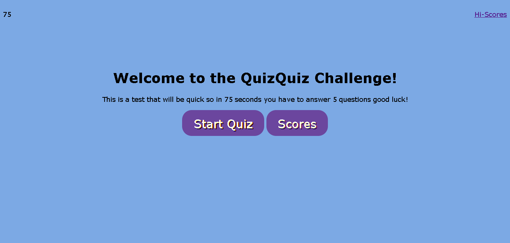

# A simple timed quiz that is supposed to track the score of the player

* Timer starts from 75 sec
* When user clicks A question and 4 choices will appear
* When a question is answered user will be presented with another question
* user will get penalized -10 sec if question is answered incorrectly
* When all questions are answered or timer is reduced to 0 It's game over
* user can input initials 

- On a side note this assignment was very challenging and although I made many mistakes with my attempts to complete this taks, I can surely say I learned a lot throughout this challenge. 

- Github repo https://github.com/Tonycodesnow/QuizQuiz

- Live site on browser https://tonycodesnow.github.io/QuizQuiz/